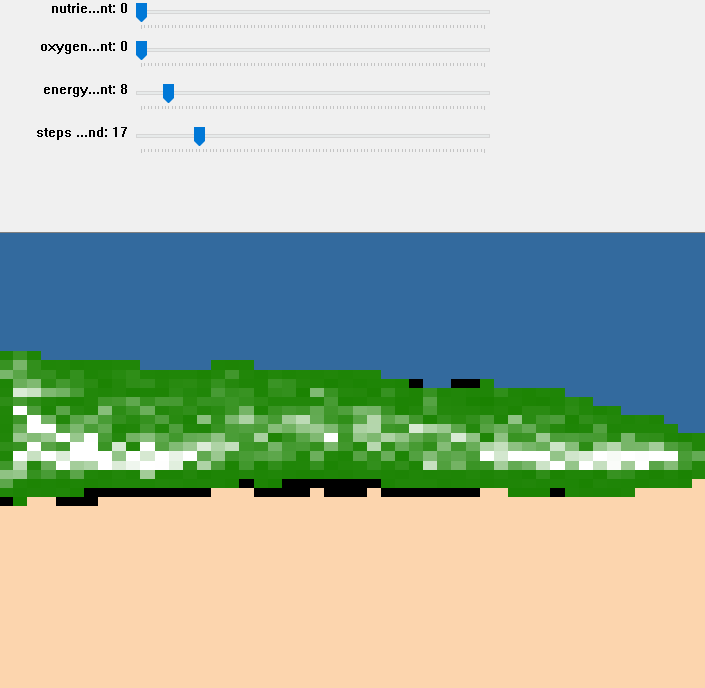
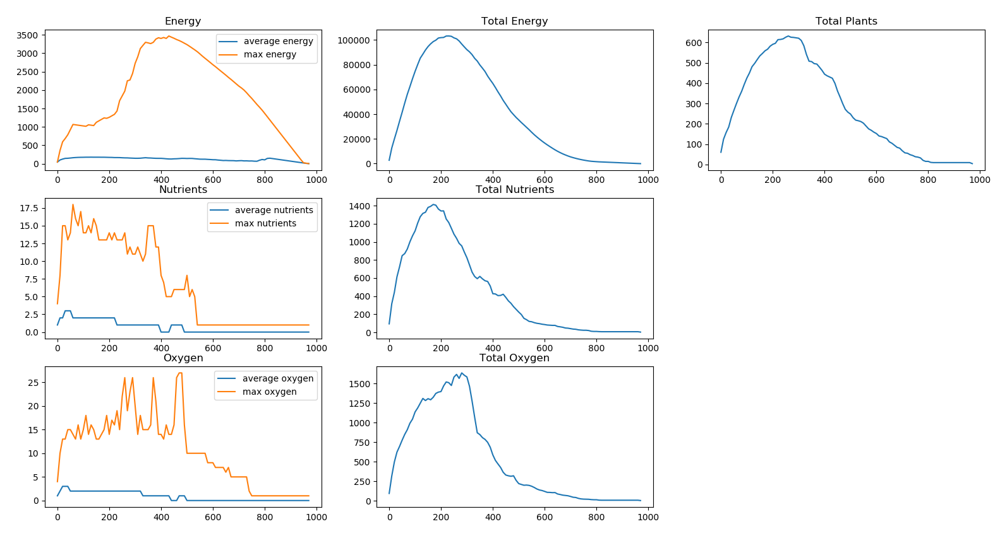
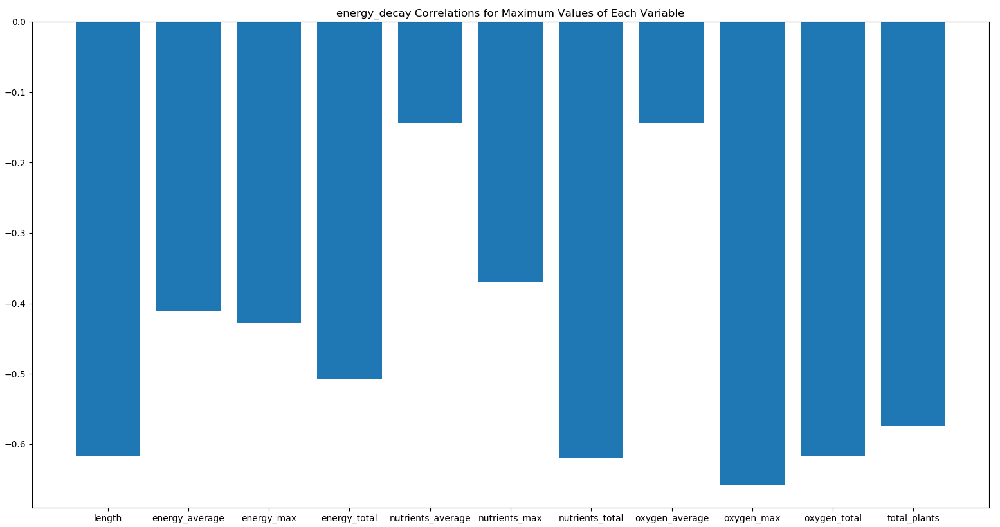
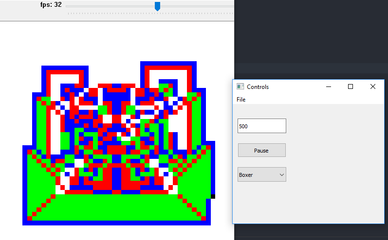

# EGOL (Emergence/Game of Live)

This repo is a set of emergence experiments, some similar to Conway's Game of Life. Contained projects:

### Tree

A simulation of a plant-like organism which utilizes oxygen and nutrients to create energy and grow. 

### Ants

Langton's ant, with some loading and saving tools for a handful of variations

### Follower

Similar to boids, but somewhat bugged. Decided to not pursue.

### Groupmover

Similar to boids, but boring functionality. Decided to not pursue.

## Project Specifics

### Tree

#### Game Rules 

Tree operates based on the following set of rules:

* Air and dirt give oxygen and nutrients to all plants nearby
* Spaces that are not plant that accumulate energy >= GROW_THRESHOLD become plants. Their nutrients and oxygen levels are set to 0
* Plants with energy > GROW_THRESHOLD + 8*2 can give 2 energy to all surrounding spaces.
* Plants with no energy die and turn into empty
* Plants with both OXYGEN_FOR_ENERGY oxygen and NUTRIENTS_FOR_ENERGY nutrients can remove both to produce ENERGY_FROM_PHOTO energy
* Plants lose ENERGY_DECAY per turn

GROW_THRESHOLD, OXYGEN_FOR_ENERGY, NUTRIENTS_FOR_ENERGY, ENERGY_FROM_PHOTO, and ENERGY_DECAY are by default set to 10, 2, 2, 2, 50, 1. These values in addition to width and height comprise the configuration of a simulation.

#### Files 

* tree/tree_engine.pyx contains the world engine. Create a new simulation with Grid(). Step the simulation with Grid.step(). Get an image representation of the grid with Grid.convert_to_image(x,y,z), where x,y,z determine the weight of nutrients, oxygen, and energy in the rendering. I'm not trying to write full documentation about it here but that's the gist.
* tree/tree_driver.py runs one or a set of simulations based on a bool: RUN_BATCH. If RUN_BATCH, a set of simulations will be run without UI and will input their simulation data into a database: tree_stats.db. These simulations vary the configuration variables (besides height and width) randomly, but only vary one off of norm per simulation.
* tree/tree_stats.py creates data visualizations for one or more previously run simulations in the database. The main method of this file can be tinkered with to target a single simulation to show resource plots, or can target all simulations in the database to show coorelations between configuration variables and measured simulation stats.

#### Stats & Data Visualizations

Example of Single Simulation Resource Stats

Example of Multiple Simulation Config/Simulation Stat Coorelation

### Ants

Ants follows the rules for Langton's Ant. This implementation contains a handful of patterns. The implementation supports ant turns of 45 degree increments. The control window allows for saving and loading of new or existing saved simulations. The control window also allows pausing, and controlling the number of steps per second for the ant. The engine is far from optimized so the number of steps per second has a functional cap of somewhere between 100 and 1000 (very specific, I know).

## Requirements

pip install numpy scipy cv2 pyqt5 cython matplotlib

You will have to install [sqlite3](https://www.sqlite.org/download.html) support separately from pip.